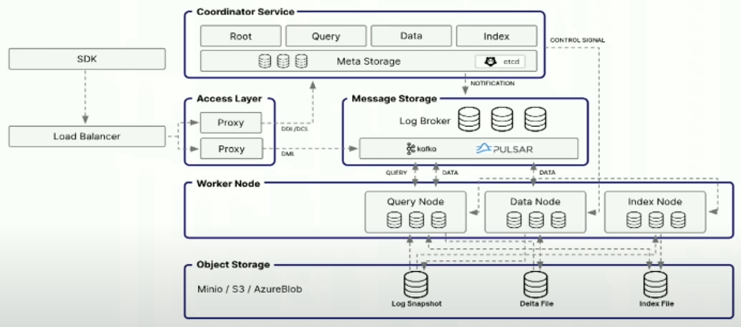

# Milvus DB 구조 및 동작 원리

  

---

## Milvus DB의 배포 구조에 따른 종류

| 종류        | 배포방식        | 서버 필요 여부       | 확장성   | 주요 용도               | 단점                  |
|-------------|-----------------|---------------------|----------|------------------------|-----------------------|
| Lite        | X (Only Python Library) | X                   | 없음     | 로컬 테스트             | 대규모 데이터 미지원   |
| Standalone  | 단일 서버       | X                   | 낮음     | 소규모 프로젝트, 개발 환경 | 서버 장애 시 문제 발생  |
| Distributed | 분산 시스템     | 있음                | 높음     | 대규모 벡터 검색, AI 서비스 | 배포 및 관리가 어려움  |

---

## Coordinator Service

- 각 Coordinator는 각각에 맞는 Node를 관리  
- 각 Node들이 각자의 역할을 수행할 수 있도록 스케줄 관리, 쿼리 라우팅, 인덱싱 작업 조정 등을 수행

---

## Coordinator / Node의 종류 및 역할

### ① Query Node & Query Coordinator (쿼리 처리)

- **Query Node**: 벡터 검색 및 유사도 계산 수행  
- **Query Coordinator**: Query Node를 관리하고, 적절한 노드로 쿼리를 라우팅

### ② Data Node & Data Coordinator (데이터 처리)

- **Data Node**: 데이터 삽입, 삭제, 업데이트 처리  
- **Data Coordinator**: Data Node를 관리하고 데이터 배포 및 적재 스케줄링

### ③ Index Node & Index Coordinator (인덱싱)

- **Index Node**:  
  - 벡터 데이터에 대한 인덱스를 생성 (HNSW, IVF, PQ 등 지원)  
  - Segment를 배치 처리 주기에 맞춰 새로운 형태로 변환  
  - 작은 Segment를 합쳐 검색 성능 최적화 (Growing Segment → Sealed Segment)  
  - Query Node와 협업하여 최적의 인덱스 활용을 지원  
- **Index Coordinator**: Index Node를 관리하고 인덱스 작업을 조정

### ④ MetaStore (메타데이터 저장)

- 벡터 컬렉션의 메타데이터 및 스키마 정보를 관리 (Etcd 사용)

### ⑤ Storage (저장소)

- 벡터 데이터 및 인덱스를 저장 (S3, MinIO, Ceph, HDFS 등 지원)

### ⑥ Log Broker

- Milvus는 데이터 저장 및 검색 요청을 비동기 메시지 큐를 통해 처리  
- 로그 및 데이터 변경 사항을 관리하는 핵심 컴포넌트  
- 주로 데이터 삽입, 요청 관리 및 노드 간 데이터 동기화, 스트리밍 데이터 처리 수행

#### Log Broker의 종류

| Log Broker Type | 설명                                        |
|-----------------|---------------------------------------------|
| Apache Pulsar   | 기본 설정, 고성능 스트리밍 및 확장성 지원   |
| Apache Kafka    | 대규모 로그 데이터 처리 가능 (추가 설정 필요) |

---

## Insert / Delete 동작 원리

1. **Client → Proxy**  
   - Client에서 Insert/Delete 요청을 보냄  
   - Load Balancer가 요청을 적절한 Proxy 노드로 분배

2. **Proxy → Root Coordinator**  
   - Proxy가 Root Coordinator(RC)에 요청 전달  
   - RC는 전체 상태(리소스, 노드 가용성 등)를 확인

3. **Root Coordinator → Data Coordinator**  
   - RC는 Data Coordinator(DC)로 요청 전달  
   - DC는 DataNode 상태(로드, 스케줄)를 확인

4. **Data Coordinator → DataNode**  
   - DC가 적절한 DataNode 선택 및 요청 할당

5. **DataNode → Logbroker**  
   - DataNode가 데이터를 Logbroker(Apache Pulsar/Kafka)에 기록  
   - Logbroker는 데이터 변경 사항을 로그 스트림으로 관리  
   - 비동기 방식으로 메시지 큐를 통해 순차 처리

6. **Logbroker → DataNode (다시 전달)**  
   - DataNode가 Logbroker에서 데이터를 가져와 처리  
   - 일정량 이상 데이터 쌓이면 Flush 실행

7. **DataNode → Storage**  
   - 데이터가 충분히 쌓이면 S3/MinIO/Disk 등 스토리지에 저장

8. **Delete 요청 처리**  
   - 직접 삭제하지 않고 Soft Delete(비활성화 태그 추가) 처리

9. **Client Response**  
   - 역순으로 응답을 반환하여 Client에 최종 처리 결과 전달

---

## Search 동작 원리

1. **Client → Proxy**  
   - Client가 벡터 검색(Search) 요청을 보냄  
   - Load Balancer가 요청을 적절한 Proxy 노드로 분배

2. **Proxy → Query Coordinator (QC)**  
   - Proxy가 Query Coordinator에 검색 요청 전달  
   - QC는 QueryNode 상태(부하, 가용성 등) 확인  
   - 최적의 QueryNode를 선택하여 요청 배분

3. **Query Coordinator → Query Node**  
   - QC가 적절한 QueryNode에 검색 요청 전달

4. **QueryNode → Mem Table(메모리) + Index(디스크) 조회**  
   - MemTable(메모리): 아직 Flush되지 않은 최신 데이터 확인  
   - Index(디스크): 이미 인덱싱된 데이터에서 벡터 검색 수행

5. **QueryNode → IndexNode (필요 시 호출)**  
   - HNSW, IVF_FLAT, FAISS 등 인덱스를 활용하여 검색 최적화

6. **Query Node → Reranking & Filtering**  
   - 검색 결과 필터링 및 정렬  
   - 조건 검색(Scalar Filtering) 필요 시 추가 연산 수행  
     (예: `color = 'red'` 같은 속성 필터링)

7. **Query Node → Query Coordinator (결과 반환)**  
   - 최종 검색 결과를 QC에 전달

8. **Query Coordinator → Proxy → Client**  
   - 검색 결과가 역순으로 Client에게 반환  
   - Client는 결과를 받아 원하는 형태로 활용

